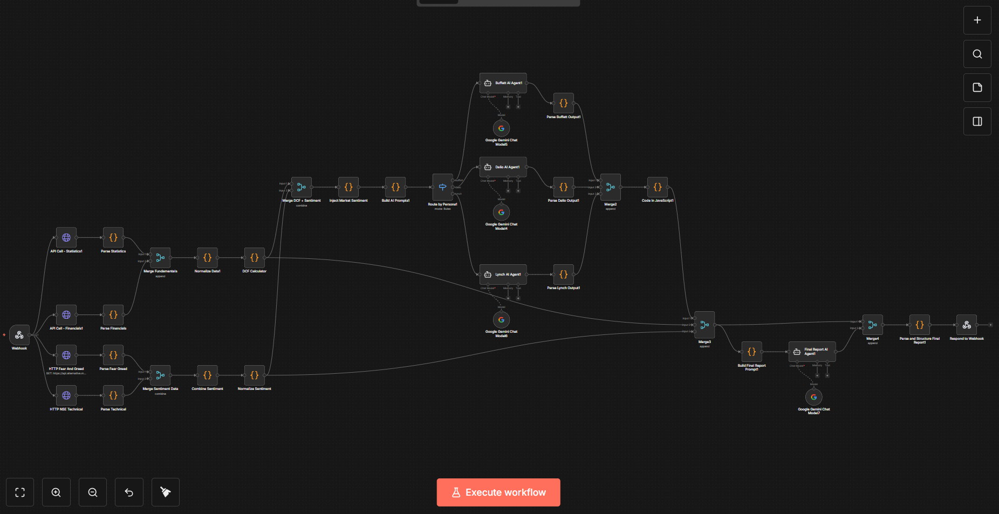

# 🚀 InvestIQ — AI Multi-Agent Stock Analysis System

> **An AI-powered system that analyzes stocks like legendary investors and generates institutional-grade investment reports.**

---

## 📌 What is InvestIQ?

**InvestIQ** is a multi-agent AI system that evaluates stocks using:

* 📊 Financial data (fundamentals)
* 📈 Technical indicators (RSI, volume)
* 🧠 Market sentiment

It simulates three investor philosophies:

* Warren Buffett — Value Investing
* Ray Dalio — Risk & Macro
* Peter Lynch — Growth Investing

Each AI independently analyzes the stock, and a final AI generates a **structured investment report**.

---

## ❓ Why InvestIQ?

Stock analysis is:

* ❌ Complex (many metrics)
* ❌ Time-consuming
* ❌ Emotion-driven

Even after doing everything right, human decisions can be biased.

### 💡 Our Solution

Instead of telling users *what to buy*, InvestIQ:

* ✅ Explains **why a stock is good or bad**
* ✅ Combines multiple investment perspectives
* ✅ Helps users make **better decisions**

> “We don’t replace investors — we empower them.”

---

## ⚙️ How It Works

### 🧩 Pipeline

```
User Input (Ticker)
        ↓
Data Collection (APIs)
        ↓
Feature Engineering (DCF, ROE, Growth)
        ↓
Multi-Agent AI Analysis
        ↓
Consensus Engine
        ↓
Final Investment Report
```

---

## 🖼️ System Architecture


---

## 🧠 AI Personas

### 🟢 Value Investor (Buffett)

* Intrinsic value
* Margin of safety
* ROE

### 🔵 Macro Risk Analyst (Dalio)

* Debt
* Cash flow
* Economic resilience

### 🟡 Growth Investor (Lynch)

* Revenue growth
* Earnings momentum
* Market sentiment

---

## 📊 Features

* 📈 Fundamental Analysis (P/E, ROE, margins)
* 📉 Technical Indicators (RSI, volume)
* 🧠 Sentiment Analysis (Fear & Greed)
* 🤖 Multi-Agent AI reasoning
* 📄 Structured JSON investment reports
* ⚖️ Consensus-based scoring system

---

## 🧪 Scoring System

* Each AI agent gives a **score (0–100)**
* Baseline = **50 (neutral)**
* Final score = weighted combination:

```
Buffett: 35%
Dalio:   30%
Lynch:   35%
```

---

## 💻 Tech Stack

### Backend & Automation

* n8n (workflow orchestration)

### APIs

* Yahoo Finance
* Market data APIs
* Fear & Greed Index

### AI

* Google Gemini (LLM-based agents)

### Programming

* JavaScript (data processing)

---

## 🖥️ Frontend Screenshots


---

## 🔗 n8n Workflow



---

## 📄 Final Report Output


---

## ⚠️ Limitations

* Heuristic AI scoring (not deterministic)
* Sentiment uses proxy data
* Free Cash Flow is estimated
* Not financial advice

---

## 🚀 Future Improvements

* 📊 Real-time stock suggestions
* 🧠 RAG-based financial knowledge
* 📈 Backtesting & dynamic scoring
* 👤 Personalized investor profiles
* 📡 Live alerts & automation

---

## 🧬 Innovation

> Multi-agent AI + financial analysis + explainability

Unlike traditional tools:

* ❌ Single model
* ❌ Raw data

We provide:

* ✅ Multiple perspectives
* ✅ Reasoning + explanation
* ✅ Final decision synthesis

---

## 🏆 Use Cases

* Beginner investors
* Intermediate traders
* Educational tools
* Financial analysis platforms

---

## 📢 Disclaimer

> This project is for educational purposes only and does not provide financial advice.

---

## ⭐ Final Thought

> “InvestIQ transforms stock analysis from guesswork into structured, explainable decision-making.”

